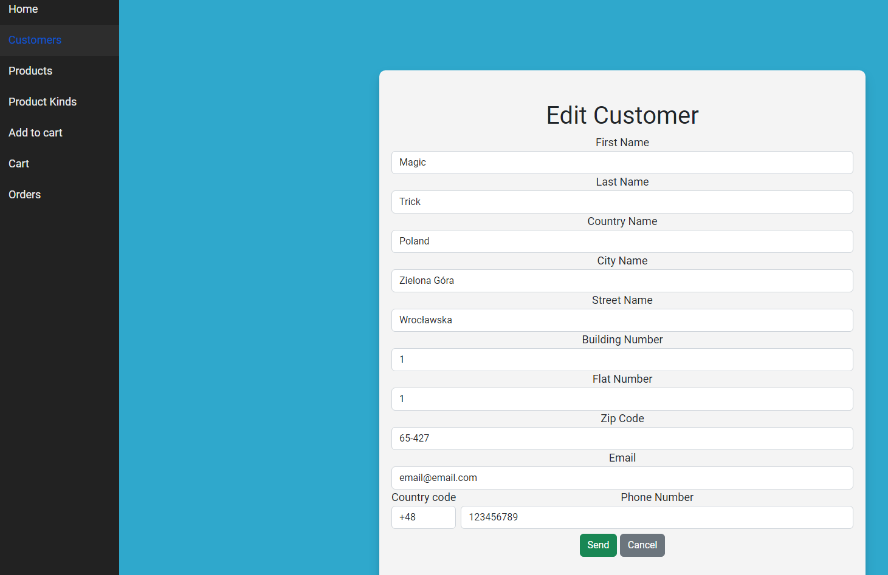

#  MyOrders

Projekt posiada aplikację serwerową oraz kliencką. Backend został napisany w Net 6 a frontend w czystym JS bazując na projekcie **js-env-from-scratch**. 

Technologie:
- Net 6
- EF Core
- Pomelo EF Core
- MySQL
- Javascript
- Jasmine
- Babel
- Axios

Przykładowe screeny:

